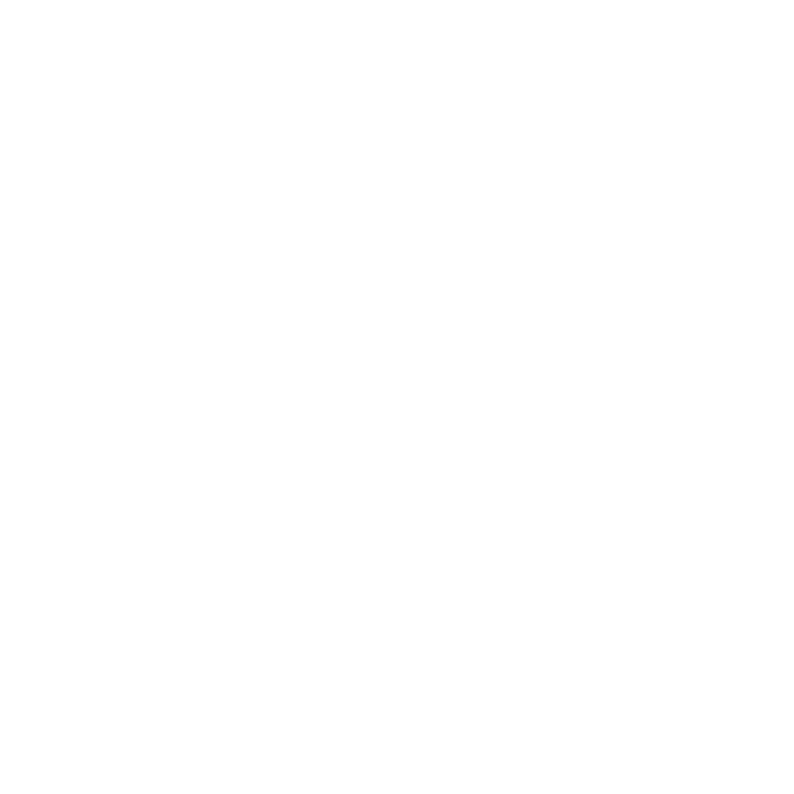

<div align="center">
  
  <h1>RIZMEC — Intelligence. Engineered.</h1>
  <p><strong>Global Technology Engineering Platform</strong></p>
  <p>
    High-performance software systems · AI architectures · Distributed platforms · Mission-critical cloud solutions
  </p>

  <br />

  
  
  
  
  
  
</div>

---

## Table of Contents

- [Overview](#overview)
- [Features](#features)
- [Tech Stack](#tech-stack)
- [Project Structure](#project-structure)
- [Getting Started](#getting-started)
- [Environment Variables](#environment-variables)
- [SEO & Sitemap](#seo--sitemap)
- [Security & RBAC](#security--rbac)
- [Scripts](#scripts)
- [License & Authors](#license--authors)

---

## Overview

**RIZMEC** is a full-stack enterprise technology platform built with Next.js 16 (App Router), React 19, and MongoDB. It powers the public-facing corporate website, client portals (invoices & quotations), and a comprehensive admin dashboard with CMS, CRM, and RBAC capabilities.

---

## Features

### 🌐 Public Website

- **Dynamic Homepage** — Hero, capabilities showcase, client testimonials, and technology highlights
- **Services & Capabilities** — Detailed service pages with rich content sections
- **Products** — Product catalog with individual detail pages
- **Engineering / Work** — Project portfolio with case studies and technical deep-dives
- **Team** — Team member profiles with bios and social links
- **Contact** — Server-side contact form with Nodemailer SMTP integration
- **Legal Pages** — Privacy policy, terms of service, and security policy

### 🔗 Client Portals

- **Invoice Portal** — Tokenized public invoice view with PDF export (jsPDF + html2canvas)
- **Quotation Portal** — Tokenized public quote view with acceptance workflow

### ⚙️ Admin Dashboard

- **Content Management (CMS)** — Dynamic page builder, TipTap rich text editor, custom slug routing
- **Project Management** — Create, edit, and publish engineering case studies
- **Services & Products** — Full CRUD with image uploads via UploadThing
- **Team Management** — Add and manage team member profiles
- **Client & Lead CRM** — Track clients, leads, and business pipeline
- **Invoicing & Quotations** — Generate, send, and track invoices and quotes
- **Contact Messages** — View and manage contact form submissions
- **Email Campaigns** — Mailing system with template management
- **Media Library** — Centralized asset management powered by UploadThing
- **User & Role Management** — Granular RBAC permission matrix
- **Testimonials** — Manage client testimonials
- **Audit Logs** — Activity tracking for admin actions
- **System Settings** — Company settings, maintenance mode toggle

---

## Tech Stack

| Domain | Technologies |
| :--- | :--- |
| **Framework** | [Next.js 16](https://nextjs.org/) (App Router), [React 19](https://react.dev/), [TypeScript 6](https://www.typescriptlang.org/) |
| **Styling** | [Tailwind CSS](https://tailwindcss.com/), [Radix UI](https://www.radix-ui.com/), [Lucide Icons](https://lucide.dev/), [Framer Motion](https://www.framer.com/motion/) |
| **Database** | [MongoDB](https://www.mongodb.com/) + [Mongoose](https://mongoosejs.com/) |
| **Authentication** | [Clerk](https://clerk.com/) (`@clerk/nextjs`) |
| **Rich Text Editor** | [TipTap](https://tiptap.dev/) (blockquotes, code blocks, images, links, highlights) |
| **File Uploads** | [UploadThing](https://uploadthing.com/) |
| **PDF Generation** | [jsPDF](https://github.com/parallax/jsPDF) + [html2canvas](https://html2canvas.hertzen.com/) |
| **Email** | [Nodemailer](https://nodemailer.com/) |
| **Validation** | [Zod](https://zod.dev/) + [React Hook Form](https://react-hook-form.com/) |

---

## Project Structure

```
rizmec/
├── app/
│   ├── (root)/               # Public pages (home, services, products, work, team, contact, about)
│   ├── api/                  # API routes (contact, uploadthing, email, seed)
│   ├── dashboard/            # Admin dashboard
│   │   ├── clients/          # Client management
│   │   ├── contact-messages/ # Contact form submissions
│   │   ├── invoices/         # Invoice management
│   │   ├── leads/            # Lead tracking
│   │   ├── mailing/          # Email campaigns
│   │   ├── media/            # Media library
│   │   ├── pages/            # CMS page builder
│   │   ├── products/         # Product management
│   │   ├── projects/         # Project/case study management
│   │   ├── quotations/       # Quote management
│   │   ├── services/         # Service management
│   │   ├── settings/         # System settings
│   │   ├── team/             # Team member management
│   │   ├── testimonials/     # Testimonial management
│   │   └── users/            # User & RBAC management
│   ├── robots.ts             # Dynamic robots.txt generation
│   ├── sitemap.ts            # Dynamic XML sitemap generation
│   ├── favicon.ico           # Site favicon
│   ├── globals.css           # Global styles
│   └── layout.tsx            # Root layout with SEO metadata
├── components/
│   ├── dashboard/            # Dashboard-specific components
│   ├── invoice/              # Public invoice view
│   ├── quote/                # Public quote view
│   ├── shared/               # Shared components (Header, Footer, Logo, PageSectionRenderer)
│   └── ui/                   # Radix UI primitives & design system
├── constants/                # Navigation, permissions, static config
├── hooks/                    # Custom React hooks
├── lib/
│   ├── actions/              # Server actions (CRUD, RBAC, email)
│   ├── auth/                 # RBAC rules & middleware
│   ├── database/             # Mongoose connection & models
│   └── utils.ts              # Utility helpers
├── public/
│   └── assets/images/        # Brand assets (logos, icons, favicon)
├── scripts/                  # Database seed scripts
├── types/                    # TypeScript type definitions
├── next.config.ts            # Next.js configuration
├── tailwind.config.ts        # Tailwind CSS theme
└── package.json              # Dependencies & scripts
```

---

## Getting Started

### Prerequisites

- **Node.js** ≥ 18.x
- **npm** ≥ 9.x
- **MongoDB** — Local instance or [MongoDB Atlas](https://www.mongodb.com/cloud/atlas) cluster

### Installation

```bash
git clone https://github.com/ninazmul/rizmec.git
cd rizmec
npm install
```

### Environment Setup

```bash
cp .env.example .env.local
```

Populate `.env.local` with your credentials (see [Environment Variables](#environment-variables)).

### Run Development Server

```bash
npm run dev
```

- **Public site**: [http://localhost:3000](http://localhost:3000)
- **Admin dashboard**: [http://localhost:3000/dashboard](http://localhost:3000/dashboard)

### Seed Database

```bash
npx tsx scripts/seed-rizmec.ts
npx tsx scripts/seed_admins.ts
```

---

## Environment Variables

| Variable | Description |
| :--- | :--- |
| `NEXT_PUBLIC_CLERK_PUBLISHABLE_KEY` | Clerk frontend public key |
| `CLERK_SECRET_KEY` | Clerk backend secret key |
| `NEXT_PUBLIC_CLERK_SIGN_IN_URL` | Sign-in route (`/sign-in`) |
| `NEXT_PUBLIC_CLERK_SIGN_UP_URL` | Sign-up route (`/sign-up`) |
| `MONGODB_URI` | MongoDB connection string |
| `UPLOADTHING_TOKEN` | UploadThing API token |
| `SUPER_ADMIN_EMAILS` | Comma-separated Super Admin emails |
| `NEXT_PUBLIC_APP_URL` | Production & Server App URL (e.g., `https://rizmec.com`) |
| `CONTACT_RECEIVER` | Email for contact form submissions (`hello@rizmec.com`) |
| `SMTP_USER` / `SMTP_PASS` | SMTP authentication credentials |
| `SMTP_HOST` / `SMTP_PORT` | SMTP server config (`smtp.gmail.com`, `465`) |
| `MAINTENANCE_MODE` | `true` / `false` — toggles maintenance page |

---

## SEO & Sitemap

RIZMEC implements comprehensive SEO out of the box:

| Feature | Implementation |
| :--- | :--- |
| **Robots.txt** | `app/robots.ts` — Dynamic generation, blocks `/dashboard/`, `/api/`, `/sign-in/`, `/sign-up/`, `/invoice/`, `/quote/` |
| **XML Sitemap** | `app/sitemap.ts` — Auto-generates from all static pages + dynamic projects, services, products, team members, and CMS pages |
| **Meta Tags** | `app/layout.tsx` — Title template, description, keywords, Open Graph, Twitter Cards |
| **Favicon & Icons** | `app/favicon.ico` + `/assets/images/rizmec-icon.png` (512x512 PNG) |
| **Open Graph** | Site-wide OG tags with images for social sharing |
| **Twitter Cards** | `summary_large_image` cards for Twitter/X |
| **Canonical URLs** | `metadataBase` configured for proper canonical resolution |
| **Google Bot** | Max image/video/snippet previews enabled |

---

## Security & RBAC

RIZMEC implements a multi-layer security architecture:

- **Authentication** — Clerk middleware protects `/dashboard` and API routes
- **Role-Based Access Control** — Roles: `super_admin`, `admin`, `moderator`, `worker`
- **Granular Permissions** — Per-module permission matrix (`constants/permissions.ts`)
- **Super Admin Protection** — Protected emails cannot be suspended, deleted, or have permissions modified
- **Input Validation** — Zod schemas + sanitized rich text rendering (XSS prevention)
- **Route Protection** — Middleware-level auth checks on all sensitive routes

---

## Scripts

| Command | Description |
| :--- | :--- |
| `npm run dev` | Start dev server (Turbopack) |
| `npm run build` | Production build (Webpack) |
| `npm run start` | Start production server |
| `npm run lint` | ESLint checks |
| `npx tsx scripts/seed-rizmec.ts` | Seed database with initial data |
| `npx tsx scripts/seed_admins.ts` | Seed super admin users |

---

## License & Authors

- **Author**: [Nazmul](https://github.com/ninazmul) — `nazmulsaw@gmail.com`
- **Organization**: [RIZMEC](https://rizmec.com)
- **Official Contact**: [hello@rizmec.com](mailto:hello@rizmec.com)
- **License**: MIT

---

<div align="center">
  <sub>Built with precision by <strong>RIZMEC Engineering</strong></sub>
</div>
